# App and Web with [Expo](https://expo.io/)


Let's create an application prototype from start to finish!

What we'll make:

- A calculator that calculates how much you love cats 🐱

What we'll support:

-  Web (all platforms)
-  App (iOS and Android)

This is all made possible by [React Native](https://reactnative.dev/) and [Expo](https://expo.io/).

[React Native](https://reactnative.dev/) is a framework for writing applications for iOS and Android. It is native, meaning your app is developed specifically for one platform and can take full advantage of all the devices features.

[Expo](https://expo.io/) is a tool to make [React Native](https://reactnative.dev/) easier - it makes it possible to make only one code that can be used both on iOS, Android and on the web (by using the open source project [React Native for Web](https://github.com/necolas/react-native-web)). You will lose some advanced functionalities with [Expo](https://expo.io/), but [Expo](https://expo.io/) has many upsides that will boost your learning - and you can always eject your project from [Expo](https://expo.io/), if you ever need to!

React Native is working on native support for Windows and Mac, and Expo already supports [wrapping your application](https://docs.expo.io/guides/using-electron/) with [Electron](https://www.electronjs.org/) (although experimentally), if you should need native desktop support as well.

For simplicity's sake, we will only support Web, iOS and Android here, as that is sufficient in most cases.

## Table of contents <!-- omit in toc -->
- [App and Web with Expo](#app-and-web-with-expo)
  - [🚀 Quick Start](#-quick-start)
  - [🎓 Prerequisites](#-prerequisites)
  - [🔧 Setup](#-setup)
  - [🕸️ Create a Web App](#️-create-a-web-app)
  - [📱 iOS and Android](#-ios-and-android)
  - [✨ Polishing](#-polishing)
  - [🌐 Publish to web *- for free!*](#-publish-to-web---for-free)
  - [📲 Publish app for testing *- for free!*](#-publish-app-for-testing---for-free)
  - [💲 Publish to app stores *- not free...*](#-publish-to-app-stores---not-free)
  - [🤔 What's next?](#-whats-next)
  - [💡 Tips and Tricks](#-tips-and-tricks)

## 🚀 Quick Start

If you are a proficient developer already, clone this repo and start developing, or take a look at [Expo's documentation](https://docs.expo.io/).

Otherwise, follow the guide below.

## 🎓 Prerequisites

This is stuff you should know a bit about before we start. Feel free to skip to the [setup](#-setup), but I recommend you to have a basic grasp of these concepts before continuing (but you don't have to). I have linked to resources for all of them. 

---

_Warning: If you are new to all of this, don't spend too much time on tutorials; just skip through to get a feeling for what they do - you can look them up later when you need to._

_I see too many new developers get stuck in tutorial land, and I would recommend you to learn as you go, as it's often the most effective way of learning for most people. You may be different, so do what you feel is right, but keep it in mind._

---

- Terminal ([Windows](https://www.youtube.com/watch?v=jbvqCqb-HJk), [Linux](https://www.suse.com/c/working-command-line-basic-linux-commands/), [Mac](https://www.youtube.com/watch?v=5XgBd6rjuDQ))
- [HTML](https://www.youtube.com/watch?v=UB1O30fR-EE&list=PLzWjrc7MKKxyffsM7YTBnogYpBh_QUIO0)
- [CSS](https://www.youtube.com/watch?v=yfoY53QXEnI&list=PLzWjrc7MKKxyffsM7YTBnogYpBh_QUIO0)
- [Javascript](https://www.youtube.com/watch?v=2nZiB1JItbY&list=PLzWjrc7MKKxyffsM7YTBnogYpBh_QUIO0)
- [Node](https://www.youtube.com/watch?v=uVwtVBpw7RQ&list=PLzWjrc7MKKxyffsM7YTBnogYpBh_QUIO0)
- [NPM](https://www.youtube.com/watch?v=s70-Vsud9Vk) and [Yarn](https://www.youtube.com/watch?v=g9_6KmiBISk&list=PLzWjrc7MKKxyffsM7YTBnogYpBh_QUIO0)
- [React](https://www.youtube.com/watch?v=Tn6-PIqc4UM&list=PLzWjrc7MKKxyffsM7YTBnogYpBh_QUIO0)
- [React Native](https://www.youtube.com/watch?v=6oFuwhIibo4&list=PLzWjrc7MKKxyffsM7YTBnogYpBh_QUIO0)

## 🔧 Setup

We will need an integrated development environment (IDE), and I will use VSCode. I recommend you do the same, as it will be easier to follow along, but if you are familiar with another IDE I won't stop you.

1. Install [VSCode](https://code.visualstudio.com/)
2. Install [Node](https://nodejs.org/en/download/)
3. Install [Yarn](https://yarnpkg.com/lang/en/docs/install/)
4. Install [Git](https://git-scm.com/)
5. [Create a GitHub user](https://github.com/join)
6. Open VSCode
7. Install VSCode extension (optional, but recommended)
    1. Open extensions  
        
    2. Install these extensions
        - Prettier
        - React Native Tools
        - VS Code ES7 React/Redux/React-Native/JS snippets
        - Bracket Pair Colorizer 2
        - Community Material Theme
          - I use the Palenight High Contrast variant
        - Material Icon Theme 
    3. Setup theme and icons  
        _The following only applies if you weren't prompted automatically_
        - Open the command palette
        - Run the command `Preferences: Color Theme`
            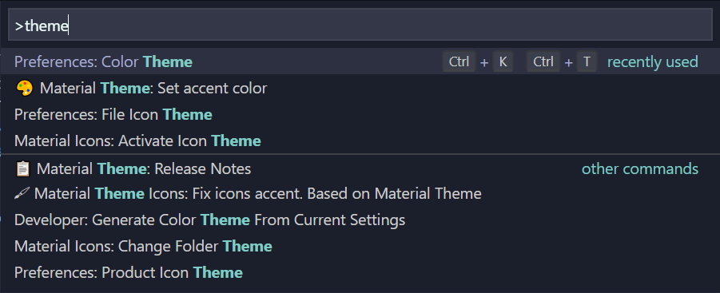  
        - Choose a Community Material Theme of your liking (I use Palenight High Contrast)
        - Open the command palette
        - Run the command `Preferences: File Icon Theme`
            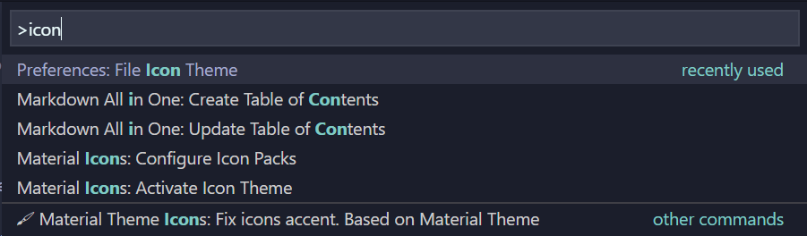  
        - Choose `Material Icon Theme`


8. Open your terminal with one of the following:
    - NO: <kbd>Ctrl</kbd> + <kbd>Ø</kbd>
    - US/UK: <kbd>Ctrl</kbd> + <kbd>`</kbd>
    - Click `View`, `Terminal` in the toolbar  
          

9. Install Expo, by pasting the following to the terminal. Press <kbd>Enter</kbd> to run the command:  

    ```shell
    yarn global add expo-cli
    ```

10. Initialize a expo project:  

    ```shell
    expo init my-project
    ```

   Choose `black` as your template when prompted (it should be the default option).

   _Note: The project will be saved where your terminal is located, so change this if you have a preferred place to store coding projects._

11. Start your app in your browser:

    ```shell
    yarn web
    ```
   
12. If everything worked correctly you should be met with this:  
      

    So let's do just that, but first - we want to store our code in the cloud.

13. Publish your repository

    - Open the command palette
    - Use the command `Publish to GitHub`
    - Confirm the repo name and choose if you want to have it public or private
    - It is now hosted on your GitHub!

14. Before we start programming, you should open up the browser's developer tools, so you get some feedback. Do one of the following:

    I am using Chrome, so this may differ if you are using another browser.

    - Windows:
        - Press <kbd>Ctrl</kbd> + <kbd>Shift</kbd> + <kbd>C</kbd>
        - ... or press <kbd>F12</kbd>
        - ... or right click the web page and choose inspect  
            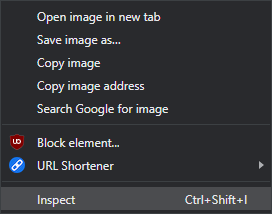  
    - Mac:
        - Press <kbd>Command</kbd> + <kbd>Option</kbd> + J</kbd>
        - ... or right click the web page and choose inspect  
            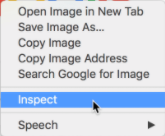  
    - Linux:
        - Press <kbd>Ctrl</kbd> + <kbd>Shift</kbd> + <kbd>C</kbd>

    Click on the console-tab, as that's where we want to be most of the time. It should look something like this:

    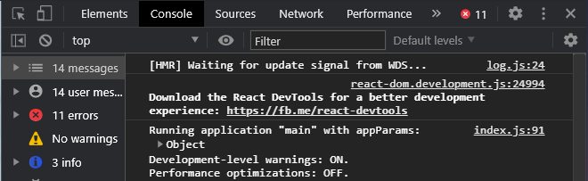

    ... and now you're ready to start developing.

## 🕸️ Create a Web App

Your app starts inn App.js*,

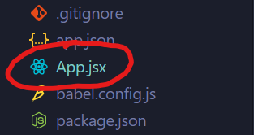  

which will look something like this:

```js
// App.js
import { StatusBar } from 'expo-status-bar';
import React from 'react';
import { StyleSheet, Text, View } from 'react-native';

export default function App() {
  return (
    <View style={styles.container}>
      <Text>Open up App.js to start working on your app!</Text>
      <StatusBar style="auto" />
    </View>
  );
}

const styles = StyleSheet.create({
  container: {
    flex: 1,
    backgroundColor: '#fff',
    alignItems: 'center',
    justifyContent: 'center',
  },
});

```

_*I will rename the file to App.jsx, because of personal preference. Feel free to do the same - just remember to restart Expo, by terminating it in the console (Click on the terminal, <kbd>Ctrl</kbd> + <kbd>C</kbd>) and running `yarn web` afterwards._

Let's reduce this as much as possible.

```js
// App.jsx
import React from "react";

export default () => {
  return null;
}
```

_Note: Remember to save for each change we do in the code!_ 

First we want a nice background. Go to [PixaBay](https://pixabay.com/) and find yourself a nice one. They are open source and free for commercial use.

Drag and drop it to your 📂 `assets`-folder.  
If that didn't work, right click the folder and pick `Reveal in File Explorer` (or equivalent, e.g. Finder), and put the image there.

Then, we import it and use it as source in an `ImageBackground`-tag.

```js
// App.jsx
import React from "react";
import { ImageBackground } from "react-native";
import background from "./assets/kitten.jpg";

export default () => {
  return (
    <ImageBackground
      source={background}
      style={{ height: "100%" }}
    ></ImageBackground>
  );
};
```

Make sure this line is actually pointing to your image, and that the image exists in `assets`.

```js
// App.jsx, line 3
import background from "./assets/kitten.jpg";
```

  

Wow. Amazing.

Let's hide that cute cat behind a card where we can sketch out our actual app.

We could reinvent the wheel here, and design all our components ourselves - but I would almost exclusively recommend using a library or framework for your UI, as you will save an enormous amount of time and effort.

I will use [UI Kitten](https://akveo.github.io/react-native-ui-kitten/) for this project.

First, we need to install it, so open up a new terminal.

  

And run these commands.

```shell
yarn add @ui-kitten/components @eva-design/eva
```

```shell
expo install react-native-svg@9.13.6 @expo/webpack-config
```

UI Kitten has some problems running with Expo out of the box at the moment, so we will have to show them how to be friends first.

Create a new file `webpack.config.js` in the *root* of your project (make sure it's not in a folder)...

  
  


...and paste this into it:

```js
// webpack.config.js
const createExpoWebpackConfigAsync = require("@expo/webpack-config");

module.exports = async function (env, argv) {
  const config = await createExpoWebpackConfigAsync(
    {
      ...env,
      babel: {
        dangerouslyAddModulePathsToTranspile: ["@ui-kitten/components"],
      },
    },
    argv
  );
  return config;
};
```

_Note: Remember to save._

Make sure you are in the node terminal running Expo.

  

Restart Expo by terminating it in the console (Click on the terminal, <kbd>Ctrl</kbd> + <kbd>C</kbd>) and running `yarn web` when done.

Add a card and some text from UI Kitten to our app. We also have to wrap our app with UI Kittens ApplicationProvider.

```js
// App.jsx
import React from "react";
import { ImageBackground } from "react-native";
import background from "./assets/kitten.jpg";
import * as eva from "@eva-design/eva";
import { ApplicationProvider, Card, Text } from "@ui-kitten/components";

export default () => {
  return (
    <ApplicationProvider {...eva} theme={eva.dark}>
      <ImageBackground source={background} style={{ height: "100%" }}>
        <Card
          style={{
            margin: "auto",
            width: 500,
            maxWidth: "100%",
          }}
          disabled
        >
          <Text>App</Text>
        </Card>
      </ImageBackground>
    </ApplicationProvider>
  );
};
```

  

Add a header to your card, so you can display the app name and optionally a tagline or something of the sort.

```js
// App.jsx
import React from "react";
import { ImageBackground, View } from "react-native";
import background from "./assets/kitten.jpg";
import * as eva from "@eva-design/eva";
import { ApplicationProvider, Card, Text } from "@ui-kitten/components";

export default () => {
  return (
    <ApplicationProvider {...eva} theme={eva.dark}>
      <ImageBackground source={background} style={{ height: "100%" }}>
        <Card
          header={Header}
          style={{
            margin: "auto",
            width: 500,
            maxWidth: "100%",
          }}
          disabled
        >
          <Text>App</Text>
        </Card>
      </ImageBackground>
    </ApplicationProvider>
  );
};

const Header = (props) => (
  <View {...props}>
    <Text category="h6">Kitten App</Text>
    <Text category="s1">Purr purr</Text>
  </View>
);
```

  

Most often an app needs input from a user, so let's add a tiny form.

```js
// App.jsx
import React from "react";
import { ImageBackground, View } from "react-native";
import background from "./assets/kitten.jpg";
import * as eva from "@eva-design/eva";
import {
  ApplicationProvider,
  Button,
  Card,
  Input,
  Text,
} from "@ui-kitten/components";

export default () => {
  return (
    <ApplicationProvider {...eva} theme={eva.dark}>
      <ImageBackground source={background} style={{ height: "100%" }}>
        <Card
          header={Header}
          style={{
            margin: "auto",
            width: 500,
            maxWidth: "100%",
          }}
          disabled
        >
          <Input
            label="Describe your favorite cat"
            placeholder="Type here..."
          />
          <Separator />
          <Input
            label="How many cats do you want?"
            placeholder="Give a number..."
          />
          <Separator />
          <Button>Calculate your love for Cats</Button>
        </Card>
      </ImageBackground>
    </ApplicationProvider>
  );
};

const Separator = () => {
  return <View style={{ margin: 8 }}></View>;
};

const Header = (props) => (
  <View {...props}>
    <Text category="h6">Kitten App</Text>
    <Text category="s1">Purr purr</Text>
  </View>
);
```

  

The form is now just visual elements on the card, but we have to add some functionality to call it an app.

There are endless ways of doing this, so I will make it as simple as possible and only use React components and functions here. If you want to learn ways of doing stuff like this more efficiently and scalable, take a look at my playlist: [Zero to Fullstack Hero](https://www.youtube.com/playlist?list=PLzWjrc7MKKxyffsM7YTBnogYpBh_QUIO0).

If you are not familiar with what's going on below, just copy-paste the whole thing and learn those concepts later by watching the playlist.

```js
// App.jsx
import React, { useState } from "react";
import { ImageBackground, View } from "react-native";
import background from "./assets/kitten.jpg";
import * as eva from "@eva-design/eva";
import {
  ApplicationProvider,
  Button,
  Card,
  Input,
  Text,
} from "@ui-kitten/components";

export default () => {
  const [fav, setFav] = useState("");
  const [num, setNum] = useState("");
  const [luv, setLuv] = useState("");

  return (
    <ApplicationProvider {...eva} theme={eva.dark}>
      <ImageBackground source={background} style={{ height: "100%" }}>
        <Card
          header={Header}
          style={{
            margin: "auto",
            width: 500,
            maxWidth: "100%",
          }}
          disabled
        >
          <Input
            label="Describe your favorite cat"
            placeholder="Type here..."
            value={fav}
            onChangeText={(text) => {
              setFav(text);
            }}
          />
          <Separator />
          <Input
            label="How many cats do you want?"
            placeholder="Give a number..."
            value={num}
            onChangeText={(text) => {
              setNum(text.replace(/[^0-9]/g, ""));
            }}
            number-pad="numeric"
          />
          <Separator />
          <Button
            onPress={() => {
              if (fav !== "" && num !== "") {
                setLuv(fav.length * Number(num));
              } else {
                setLuv("Fill in the important form above first.");
              }
            }}
          >
            Calculate your love for Cats
          </Button>
          {!!luv && (
            <>
              <Separator />
              <Text category="s1" style={{ margin: "auto" }}>
                {luv}
              </Text>
            </>
          )}
        </Card>
      </ImageBackground>
    </ApplicationProvider>
  );
};

const Separator = () => {
  return <View style={{ margin: 8 }}></View>;
};

const Header = (props) => (
  <View {...props}>
    <Text category="h6">Kitten App</Text>
    <Text category="s1">Purr purr</Text>
  </View>
);
```

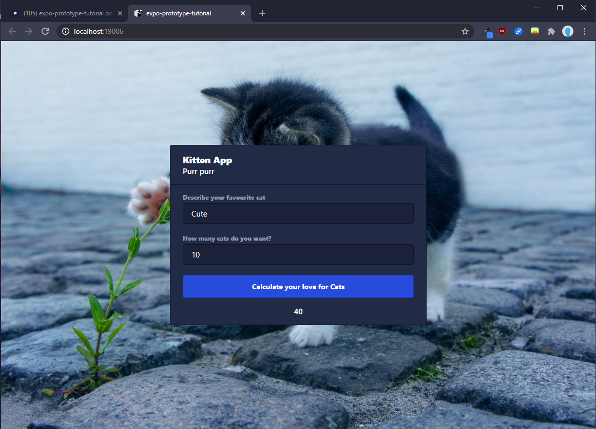  

Congrats - we now have a functioning web app! 😻

This level is sufficient for most prototypes, and you can be safe knowing that your code will be useable (with some tweaks) on mobile as well.

If you don't need an app yet, skip ahead to [🌐 Publish to web *- for free!*](#-publish-to-web---for-free).

## 📱 iOS and Android

Install the [Expo Development Client](https://expo.io/tools#client) on your mobile device of choice.

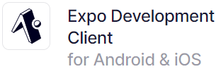  

Connect the device to the same network as your development environment (this probably won't work on a school- or work network - more on that below*).

Open up the Expo app.

Press `Scan QR Code`.

Scan the QR code on your Expo server.

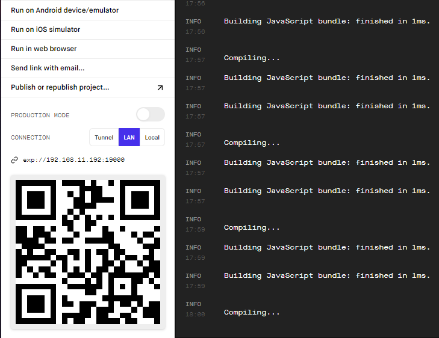  

You should connect automatically.

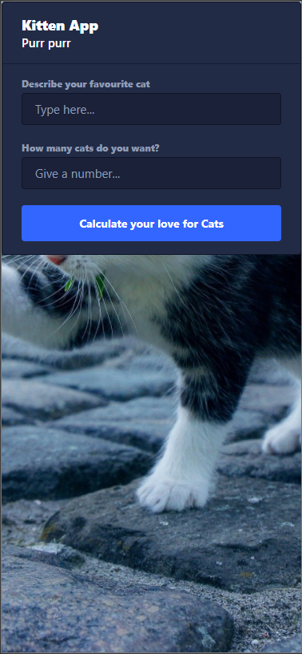  


_*IF you can't connect your device on the same network, switch to <button>Tunnel</button> instead of <button>LAN</button> and try again._

---

If you can't connect directly, you will have to install an emulator for iOS (Mac only) or Android. We won't go into detail about that here, but check out these guides if you had no luck with the above method:

- [iOS](https://docs.expo.io/workflow/ios-simulator/)  
- [Android](https://docs.expo.io/workflow/android-studio-emulator/)

If nothing works, just read on and try again on another network.

---

Now onto testing the app!

I'll just press the calculate button...

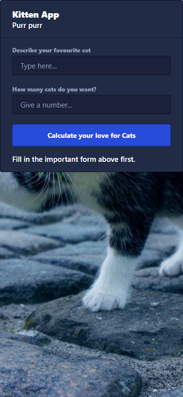  

Uh-oh 😓

That text is supposed to be center aligned. That probably means that `margin: "auto"` doesn't center things on the app. That can be fixed by using `textAlign: "center"` instead.

Thinking about it, the card was supposed to be vertically centered on the screen as well. We'll have to fix that by using [Flexbox](https://css-tricks.com/snippets/css/a-guide-to-flexbox/).

`Describe your favorite cat` seems to work ok.

`How many cats do you want?` does work, but should really have a number pad as the default input. Seems like I didn't do it right when writing the web app. I wrote `number-pad="numeric"`, but it should really be `keyboardType="number-pad"` - woopsies! 🤷‍♂️

```js
// App.jsx
import React, { useState } from "react";
import { ImageBackground, View } from "react-native";
import background from "./assets/kitten.jpg";
import * as eva from "@eva-design/eva";
import {
  ApplicationProvider,
  Button,
  Card,
  Input,
  Text,
} from "@ui-kitten/components";

export default () => {
  const [fav, setFav] = useState("");
  const [num, setNum] = useState("");
  const [luv, setLuv] = useState("");

  return (
    <ApplicationProvider {...eva} theme={eva.dark}>
      <ImageBackground
        source={background}
        style={{
          height: "100%",
          display: "flex",
          justifyContent: "center",
          alignItems: "center",
        }}
      >
        <Card
          header={Header}
          style={{
            width: 500,
            maxWidth: "100%",
          }}
          disabled
        >
          <Input
            label="Describe your favorite cat"
            placeholder="Type here..."
            value={fav}
            onChangeText={(text) => {
              setFav(text);
            }}
          />
          <Separator />
          <Input
            label="How many cats do you want?"
            placeholder="Give a number..."
            value={num}
            onChangeText={(text) => {
              setNum(text.replace(/[^0-9]/g, ""));
            }}
            keyboardType="number-pad"
          />
          <Separator />
          <Button
            onPress={() => {
              if (fav !== "" && num !== "") {
                setLuv(fav.length * Number(num));
              } else {
                setLuv("Fill in the important form above first.");
              }
            }}
          >
            Calculate your love for Cats
          </Button>
          {!!luv && (
            <>
              <Separator />
              <Text
                category="s1"
                style={{
                  textAlign: "center",
                }}
              >
                {luv}
              </Text>
            </>
          )}
        </Card>
      </ImageBackground>
    </ApplicationProvider>
  );
};

const Separator = () => {
  return <View style={{ margin: 8 }} />;
};

const Header = (props) => (
  <View {...props}>
    <Text category="h6">Kitten App</Text>
    <Text category="s1">Purr purr</Text>
  </View>
);
```

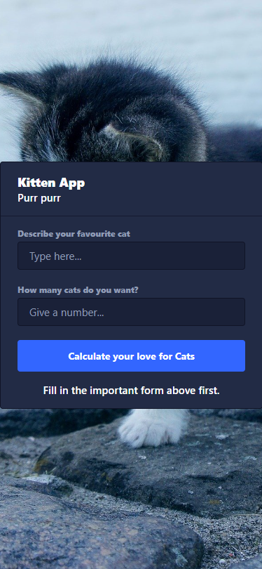  

That's better! 😸

## ✨ Polishing

In your files there is a folder named 📁 `assets`, where you'll find some images other than our background:

- `splash.png`  
    The opening/loading screen of your application
- `icon.png`  
    Icon used on iOS, Android and on Expo
- `adaptive-icon.png`  
    Two layered icon used on Android, which will be used by the OS for things like animations.
- `favicon.png`  
    Icon shown on the web

_Note that there are [guidelines](https://docs.expo.io/guides/app-icons/) if you want to publish your app to a store, but we won't dive into that._

Delete `splash.png`, `icon.png`, `adaptive-icon.png` and `favicon.png`.

To simplify and save some time, we will use the same image for all of them.

Find an icon [PixaBay](https://pixabay.com/)

I used [this](https://pixabay.com/vectors/kitten-head-kitty-feline-domestic-576502/), and named it `logo.png`.

_Expo wants PNG-files, so if you find a JPG-only image, use [JPGtoPNG](https://jpg2png.com/) to convert it._

Put the image in the 📁 `assets`-folder.

Open up the file `app.json`, so we can tell Expo we have a new image for everything. Change every image from 📁 `assets` to our new image.

This is how it will look for me and my `logo.png`:

```json
{
  "expo": {
    "name": "expo-prototype-tutorial",
    "slug": "expo-prototype-tutorial",
    "version": "1.0.0",
    "orientation": "portrait",
    "icon": "./assets/logo.png",
    "splash": {
      "image": "./assets/logo.png",
      "resizeMode": "contain",
      "backgroundColor": "#ffffff"
    },
    "updates": {
      "fallbackToCacheTimeout": 0
    },
    "assetBundlePatterns": ["**/*"],
    "ios": {
      "supportsTablet": true
    },
    "android": {
      "adaptiveIcon": {
        "foregroundImage": "./assets/logo.png",
        "backgroundColor": "#FFFFFF"
      }
    },
    "web": {
      "favicon": "./assets/logo.png"
    },
    "description": ""
  }
}
```

Here you can also add information about your app. Everything I want is here, but there's no description - so I'll add that.

```json
{
  "expo": {
    "name": "expo-prototype-tutorial",
    "slug": "expo-prototype-tutorial",
    "version": "1.0.0",
    "orientation": "portrait",
    "icon": "./assets/logo.png",
    "splash": {
      "image": "./assets/logo.png",
      "resizeMode": "contain",
      "backgroundColor": "#ffffff"
    },
    "updates": {
      "fallbackToCacheTimeout": 0
    },
    "assetBundlePatterns": ["**/*"],
    "ios": {
      "supportsTablet": true
    },
    "android": {
      "adaptiveIcon": {
        "foregroundImage": "./assets/logo.png",
        "backgroundColor": "#FFFFFF"
      }
    },
    "web": {
      "favicon": "./assets/logo.png"
    },
    "description": "A kitty love calculator for educational purposes"
  }
}
```

## 🌐 Publish to web *- for free!*

Connect your GitHub-user to [Vercel](https://vercel.com/login?next=%2Fdashboard)

Install [Vercel CLI](https://vercel.com/download) (using the terminal)

```shell
yarn global add vercel
```

Optimize assets

```shell
yarn global add sharp-cli
npx expo-optimize
```

Build the web application

```shell
expo build:web
```

Go into the web build

```shell
cd web-build
```

Deploy to Vercel

```shell
vercel
```

Follow the instructions. If it's the first time you use Vercel, you'll have to run the command `vercel` again after you're logged in.

Press <kbd>enter</kbd> for *all* prompts. You don't have to input anything.

The final command should give you the url to visit your webpage.

If it doesn't work or you want to adjust hosting settings, visit your [Vercel dashboard](https://vercel.com/dashboard). You'll find everything you need to administer your web page there.


## 📲 Publish app for testing *- for free!*

[Create an Expo account](https://expo.io/signup).

Run the following in the terminal:

```shell
expo publish
```

Login when prompted

Go to [Expo](https://expo.io/)

Login (if you haven't already)

Go to your projects

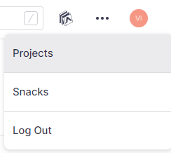  

Click on your project name

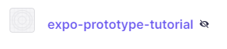  

There you should be presented with the information needed to test your app on mobile. Send the link in the address bar to your testers.

## 💲 Publish to app stores *- not free...*

This is outside the scope of this tutorial, as we are only creating a prototype.

Expo offers [documentation](https://docs.expo.io/distribution/uploading-apps/) on how you can upload apps to the official app stores, when you and your app is ready.

## 🤔 What's next?

If you liked this and want to learn more about web development, check out the [Zero to Fullstack Hero](https://www.youtube.com/playlist?list=PLzWjrc7MKKxyffsM7YTBnogYpBh_QUIO0).

Other than that, you can go ahead and make an app. Remember that Google is your friend, as am I, so ask either one of us if you need any help.

I'm available for help at [Facebook](https://www.facebook.com/kristian.kramas).

Good luck!

## 💡 Tips and Tricks

We did web first in this example to make it easier to follow along, but when you're developing, it may be a good idea to have a live version of your app open on iOS or Android (both preferably), so that you catch any errors and special cases as they pop up.

An emulator is great, if you want to set that up for [Android](https://docs.expo.io/workflow/android-studio-emulator/) or [iOS](https://docs.expo.io/workflow/android-studio-emulator/) (Mac only 💔), but it's not the same as having a device in your hand.

If something technically works on mobile and looks good, it will usually work on the web (except native features obviously) and scale up to a bigger screen. If you want to save time, it's often a good idea to design your app [mobile first](https://medium.com/@Vincentxia77/what-is-mobile-first-design-why-its-important-how-to-make-it-7d3cf2e29d00). It's always harder to do desktop first when you want cross-platform compatibility.

If you want to clone this repo, this is how to do so:
   1. Copy the GitHub-repo URL (the HTTPS one)

        

   2. Open the command palette and use the command `Git: Clone`
   3. Paste the URL
   4. Choose where you want to store it
      _Note: Cloning it will create a new folder with the project name where you choose to place it, so there is no need to make a new dedicated folder for it manually._
   5. Say yes to open the project in its own workspace