# One codebase, all platforms

Let's make a prototype from start to finish!

What we'll support:

-  Web (all platforms)
-  App (iOS and Android)

What we'll use:

- [Expo](https://expo.io/)

(That's all!)

## 🚀 Quick Start

If you are a proefficient developer already, just clone this repo and start developing.

Otherwise, follow the guide below.

## 🎓 Prerequisites

This is stuff you should know a bit about before we start. Feel free to skip to the [setup](#-setup), but I recommend you to have a basic grasp of these concepts before continuing (but you don't have to).

- Terminal ([Windows](https://www.youtube.com/watch?v=jbvqCqb-HJk), [Linux](https://www.suse.com/c/working-command-line-basic-linux-commands/), [Mac](https://www.youtube.com/watch?v=5XgBd6rjuDQ))
- HTML
- CSS
- Javascript
- Node (JavaScript runtime)
- NPM
- Yarn
- React
- React Native

## 🔧 Setup

We will need an integrated development environment (IDE) for this, and I will use VSCode for this tutorial. 

1. Install [VSCode](https://code.visualstudio.com/)
1. Install [Node](https://nodejs.org/en/download/)
1. Install [Git](https://git-scm.com/)
1. [Create a GitHub user](https://github.com/join)
1. Open VSCode
1. Install VSCode extension
   1. Open extensions  
   
      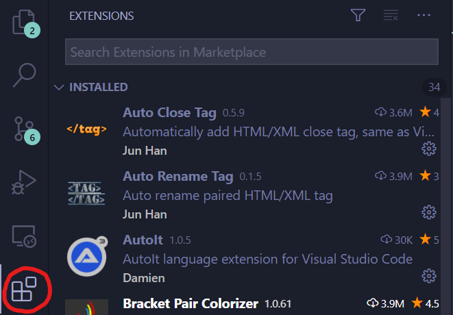
   
   1. Install these extensions
      - React Native Tools
      - VS Code ES7 React/Redux/React-Native/JS snippets
      - Community Material Theme
      - Material Icon Theme
      - Bracket Pair Colorizer 2
1. Open your terminal with one of the following:
   - NO: <kbd>Ctrl</kbd> + <kbd>Ø</kbd>
   - US/UK: <kbd>Ctrl</kbd> + <kbd>`</kbd>
   - Click `View`, `Terminal` in the toolbar  
    
      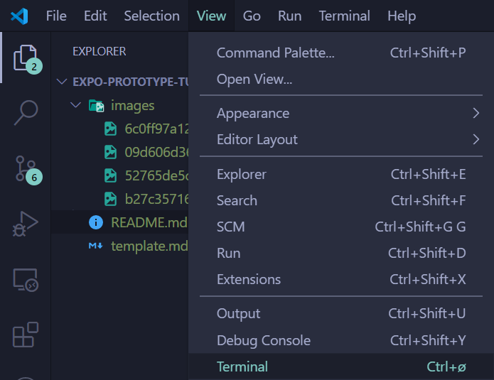  

1.  Install Expo, by pasting the following to the terminal. Press <kbd>Enter</kbd> to run the command:  

      ```shell
      npm install --global expo-cli
      ```

1. Initialize a expo project:  

      ```shell
      expo init my-project
      ```

   Choose `black` as your template when prompted (it should be the default option).

   _Note: The project will be saved where your terminal is located, so change this if you have a preferred place to store coding projects._

1. Start your app in your browser:

      ```shell
      yarn web
      ```
   
1. If everything worked correctly you should be met with this:

      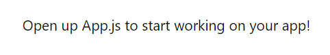  

   So let's do just that, but first - we want to store our code in the cloud.

1. Publish your repository
   - Open the command palette
   - Use the command `Publish to GitHub`
   - Confirm the repo name and choose if you want to have it public or private
   - It is now hosted on your GitHub!

## 📱 Create your App

Your app starts inn App.js, which will look something like this:

```js
// App.js
import { StatusBar } from 'expo-status-bar';
import React from 'react';
import { StyleSheet, Text, View } from 'react-native';

export default function App() {
  return (
    <View style={styles.container}>
      <Text>Open up App.js to start working on your app!</Text>
      <StatusBar style="auto" />
    </View>
  );
}

const styles = StyleSheet.create({
  container: {
    flex: 1,
    backgroundColor: '#fff',
    alignItems: 'center',
    justifyContent: 'center',
  },
});

```

_Note: I will rename the file to App.jsx, because of personal preference. Feel free to do the same - just remember to restart expo, by terminating it in the console (Click on the terminal, <kbd>Ctrl</kbd> + <kbd>C</kbd>) and running `yarn web` afterwards._

Let's minimalize this as much as possible.

```js
// App.jsx
import React from "react";

export default () => {
  return null;
}
```

_Note: Remember to save for each change we do in the code!_ 

First we want a nice background. Go to [PixaBay](https://pixabay.com/) and find yourself a nice one. They are open source and free for commercial use.

Drag and drop it to your 📂 `assets`-folder.  
If that didn't work, right click the folder and pick `Reveal in File Explorer` (or equivalent, e.g. Finder), and put the image there.

Then, we import it and use it as source in an `ImageBackground`-tag.

```js
// App.jsx
import React from "react";
import { ImageBackground } from "react-native";
import background from "./assets/kitten.jpg";

export default () => {
  return (
    <ImageBackground
      source={background}
      style={{ height: "100%" }}
    ></ImageBackground>
  );
};
```

Make sure this line is actually pointing to your image, and that the image exists in `assets`.

```js
// App.jsx, line 3
import background from "./assets/kitten.jpg";
```

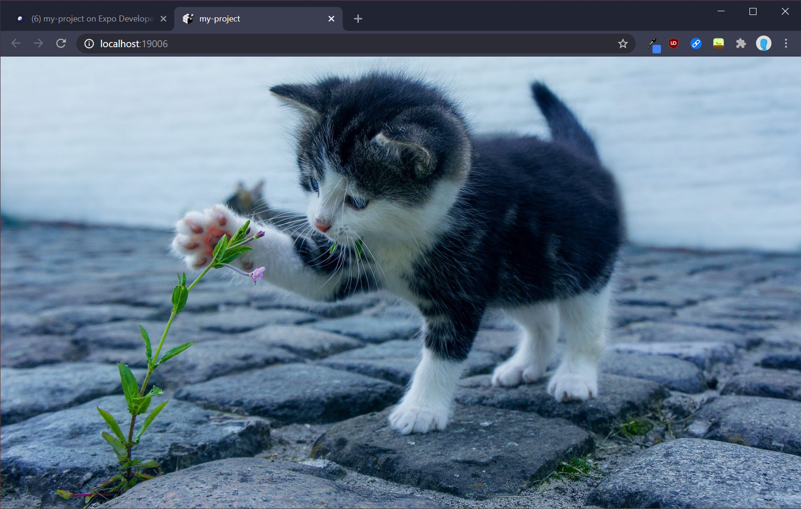  

Wow. Amazing.

Let's hide that cute cat behind a card where we can sketch out our actual app.

We could reinvent the wheel here, and design all our components ourselves - but I would almost exclusively recommend using a library or framework for your UI, as you will save an enourmous amount of time and effort.

I will use [UI Kitten](https://akveo.github.io/react-native-ui-kitten/) for this project.

First, we need to install it, so open up a new terminal.

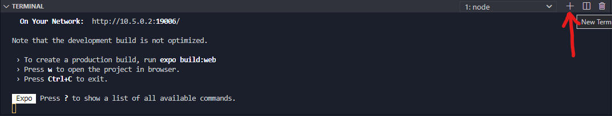  

And run these commands.

```shell
yarn add @ui-kitten/components @eva-design/eva
```

```shell
expo install react-native-svg@9.13.6 @expo/webpack-config
```

UI Kitten has some problems running with Expo out of the box at the moment, so we will have to show them how to be friends first.

Create a new file `webpack.config.js` in the *root* of your project (make sure it's not in a folder)...

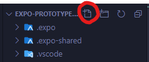  
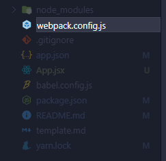  


...and paste this into it:

```js
// webpack.config.js
const createExpoWebpackConfigAsync = require("@expo/webpack-config");

module.exports = async function (env, argv) {
  const config = await createExpoWebpackConfigAsync(
    {
      ...env,
      babel: {
        dangerouslyAddModulePathsToTranspile: ["@ui-kitten/components"],
      },
    },
    argv
  );
  return config;
};
```

_Note: Remember to save._

Make sure you are in the node terminal running Expo.

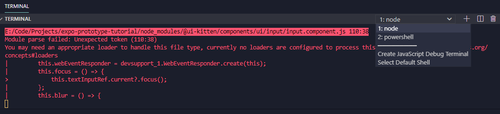  

Restart Expo by terminating it in the console (Click on the terminal, <kbd>Ctrl</kbd> + <kbd>C</kbd>) and running `yarn web` when done.

Add a card and some text from UI Kitten to our app. We also have to wrap our app with UI Kittens ApplicationProvider.

```js
import React from "react";
import { ImageBackground } from "react-native";
import background from "./assets/kitten.jpg";
import * as eva from "@eva-design/eva";
import { ApplicationProvider, Card, Text } from "@ui-kitten/components";

export default () => {
  return (
    <ApplicationProvider {...eva} theme={eva.dark}>
      <ImageBackground source={background} style={{ height: "100%" }}>
        <Card
          style={{
            margin: "auto",
            width: 500,
            maxWidth: "100%",
          }}
          disabled
        >
          <Text>App</Text>
        </Card>
      </ImageBackground>
    </ApplicationProvider>
  );
};
```

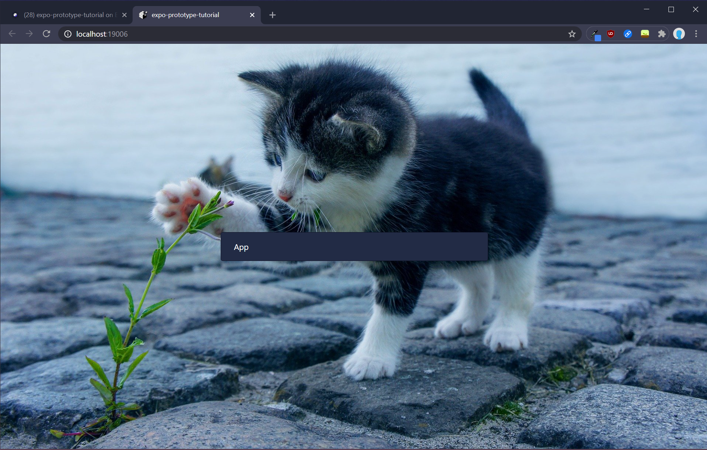  

Add a header to your card, so you can display the app name and optionally a tagline or something of the sort.

```js
import React from "react";
import { ImageBackground, View } from "react-native";
import background from "./assets/kitten.jpg";
import * as eva from "@eva-design/eva";
import { ApplicationProvider, Card, Text } from "@ui-kitten/components";

export default () => {
  return (
    <ApplicationProvider {...eva} theme={eva.dark}>
      <ImageBackground source={background} style={{ height: "100%" }}>
        <Card
          header={Header}
          style={{
            margin: "auto",
            width: 500,
            maxWidth: "100%",
          }}
          disabled
        >
          <Text>App</Text>
        </Card>
      </ImageBackground>
    </ApplicationProvider>
  );
};

const Header = (props) => (
  <View {...props}>
    <Text category="h6">Kitten App</Text>
    <Text category="s1">Purr purr</Text>
  </View>
);
```

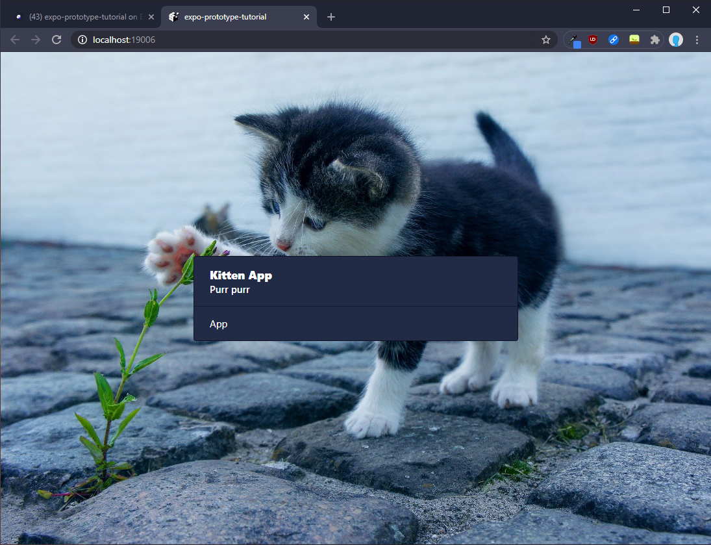  

Most often an app needs input from a user, so let's add a tiny form.

```js
import React from "react";
import { ImageBackground, View } from "react-native";
import background from "./assets/kitten.jpg";
import * as eva from "@eva-design/eva";
import {
  ApplicationProvider,
  Button,
  Card,
  Input,
  Text,
} from "@ui-kitten/components";

export default () => {
  return (
    <ApplicationProvider {...eva} theme={eva.dark}>
      <ImageBackground source={background} style={{ height: "100%" }}>
        <Card
          header={Header}
          style={{
            margin: "auto",
            width: 500,
            maxWidth: "100%",
          }}
          disabled
        >
          <Input
            label="Describe your favourite cat"
            placeholder="Type here..."
          />
          <Seperator />
          <Input
            label="How many cats do you want?"
            placeholder="Give a number..."
          />
          <Seperator />
          <Button>Calculate your love for Cats</Button>
        </Card>
      </ImageBackground>
    </ApplicationProvider>
  );
};

const Seperator = () => {
  return <View style={{ margin: ".5em" }}></View>;
};

const Header = (props) => (
  <View {...props}>
    <Text category="h6">Kitten App</Text>
    <Text category="s1">Purr purr</Text>
  </View>
);
```

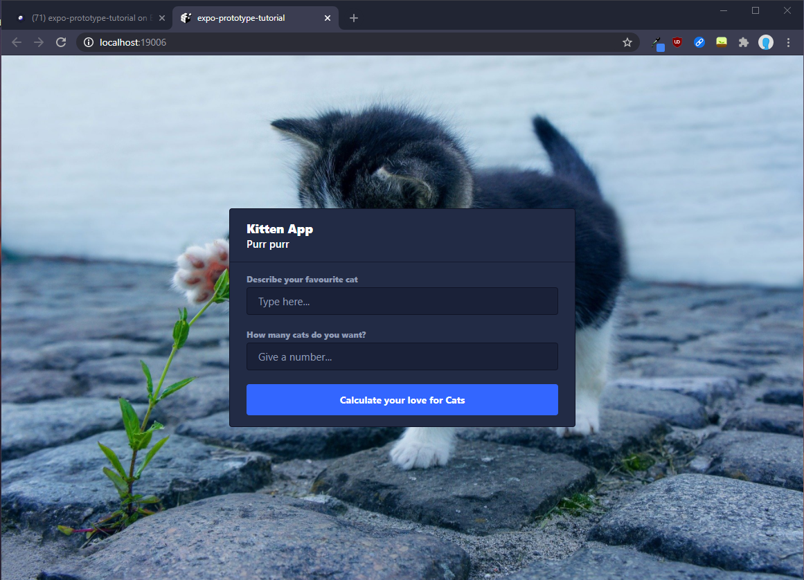  

The form is now just visual elements on the card, but we have to add some functionality to call it an app.

There are endless ways of doing this, so I will make as simple as possible and only use React components and functions here. If you want to learn ways of doing this more efficiently and scalable, take a look at my playlist: [Zero to Fullstack Hero](https://www.youtube.com/playlist?list=PLzWjrc7MKKxyffsM7YTBnogYpBh_QUIO0).

## 🌐 Publish

## 💡 Tips and Tricks

- Clone a project (this one for example)
   1. Copy the GitHub-repo URL (the HTTPS one)

        

   1. Open the command palette and use the command `Git: Clone`
   1. Paste the URL
   1. Choose where you want to store it
      _Note: Cloning it will create a new folder with the project name where you choose to place it, so there is no need to make a new dedicated folder for it manually._
   2. Say yes to open the project in its own workspace

- Right click the VSCode shortcut to open recently used projects quickly  

   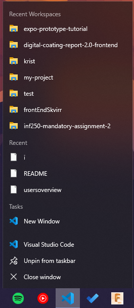  


